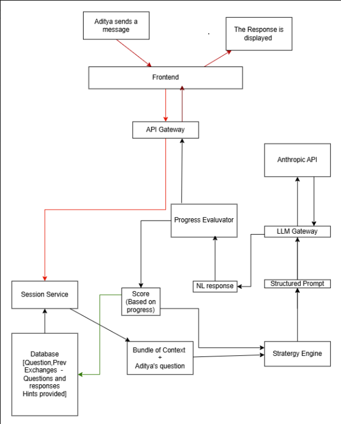

# Socra - High-Level Design (HLD)

## Overview
Socra is an AI-based reasoning coach that guides students to think logically and arrive at the optimal solution for LeetCode problems. The user pastes the problem along with the input constraints and example cases into Socra, which is then parsed. Socra shoots out the first question to assess the user’s understanding of the problem. 

The subsequent questions are asked based on how they’ve answered previous questions and how they’re progressing toward the optimal solution. If the user is stuck for more than 2 exchanges at a point, it is then escalated to a 5-Level Hint system that is designed to reveal as minimal of the approach as possible.

The scope of this design document is to design a system that has the following components: 
* Problem Ingestion
* Session Management
* Adaptive Questioning
* Hint System
* Progress Evaluator
* Session Conclusion

---

## System Architecture Diagram

---

## Component Descriptions

### Frontend
* **Owns**: The chat interface — the problem input box, the conversation thread, and the send button.
* **Does**: Captures the student's input and sends it to the API Gateway. Receives the response from the API Gateway and displays it to the student.
* **Talks to**: API Gateway.

### API Gateway
* **Owns**: The interface between the Frontend and Backend components.
* **Does**: Passes the Student input to the Session Service, receives the Natural Language response from the Progress Evaluator, and passes it to the frontend to be displayed to the student.
* **Talks to**: Session Service and Progress Evaluator.

### Session Service
* **Owns**: The data related to the current session.
* **Does**: Collects the context data related to the current session (i.e., the question, the exchanges, hints given, progress made towards the optimal solution) stored in the database. It passes this bundle of data, along with the user’s response, to the Strategy Engine.
* **Talks to**: Database and the Strategy Engine.

### Database
* **Owns**: Stores the data of sessions, including the question pasted in by the user, the exchanges, hints provided, progress towards the optimal solution, and current score provided by the Progress Evaluator.
* **Does**: Passes the bundle of data to the Session Service when queried. Stores the latest score produced by the Progress Evaluator based on the current trajectory of the user, and passes that on to the Strategy Engine.
* **Talks to**: Session Service.

### Strategy Engine
* **Owns**: The strategy of how questions must be asked to the user, based on the data bundle and the current trajectory of the user to the optimal approach.
* **Does**: It takes in the context bundle along with the user’s response from the Session Service, generates a structured prompt, and passes that on to the LLM Gateway.
* **Talks to**: Session Service, Progress Evaluator, and LLM Gateway.

### LLM Gateway
* **Owns**: The precision structured prompt and the Natural Language response.
* **Does**: It takes the precision structured prompt from the Strategy Engine and passes that on to the Anthropic API, which then sends back a Natural Language response. That’s sent to the Progress Evaluator.
* **Talks to**: Strategy Engine, Anthropic API, and Progress Evaluator.

### Progress Evaluator
* **Owns**: The logic that evaluates the progress of the user and forwards the Natural Language response to the API Gateway.
* **Does**: It calculates a score based on how the user is progressing toward the optimal approach, using the exchanges and the user’s current response. It then simultaneously sends that score to be stored in the database and updates the Strategy Engine.
* **Talks to**: Database, Strategy Engine, and API Gateway.

---

## Data Flow

1. Student types in the response and hits send.
2. The response is packaged into a JSON structure and sent through an HTTP POST request.
3. The request is provided with a header file containing a JWT token along with the JSON data.
4. The API Gateway looks at the request and authenticates the user based on the JWT Token.
5. Sends the request to the active session in the Session Service.
6. The Session Service looks at the session ID and then queries the database to get all the data related to the current session — the question, all the exchanges, hints provided, the progress of the user towards the optimal approach, and the current score.
7. It then sends out this context bundle along with the user's current response to the Strategy Engine.
8. The Strategy Engine takes in the question along with the context bundle, then assesses the strategy that can be applied based on a set of predefined rules in the form of code. This logic decides Socra's response, which puts together a precision LLM prompt.
9. The LLM prompt is sent to the LLM Gateway, which forwards the prompt out to Anthropic’s API.
10. Anthropic’s API takes the prompt and generates a Natural Language response, dressing the precision prompt in English.
11. The NL response is sent back to the LLM Gateway, which proceeds to send it out to the Progress Evaluator.
12. The Progress Evaluator sends the NL response out to be displayed via the API Gateway. Meanwhile, it generates a score based on parameters like how the user is progressing, their current score, etc. This latest score is sent to be stored in the database and simultaneously updated in the Strategy Engine.
13. The API Gateway receives the NL response and sends it back to the Frontend over HTTPS. JavaScript renders it in the chat window and displays it. The user reads the next question.

---

## Technology Choices

| Layer | Technology | Cost |
| :--- | :--- | :--- |
| **Frontend** | React + Vercel | Free |
| **Backend** | FastAPI + Railway | Free |
| **Database** | PostgreSQL + Supabase | Free |
| **Hosting** | Anthropic Claude Sonnet API | ~$0.01 |
| **Version Control** | GitHub | Free |

---

## System Boundaries

* Socra owns the Session Service, Strategy Engine, and the Progress Evaluator; these contain Socra’s business logic.
* Meanwhile, the Database query is sent out to a database hosted on an external server, and the call is made to the Anthropic API for generating a Natural Language response.
* The line between the database and the session service is the query that is made to retrieve information.
* The LLM Gateway acts as the demarcation line between the Strategy Engine and the Anthropic API.

---

## Key Design Decisions and Tradeoffs

### Decision 1: Strategy Engine logic lives in code vs. inside the LLM prompt
* **What we chose**: Strategy Engine logic lives in our codebase as explicit, rule-based code.
* **What we didn't choose**: Passing high-level instructions directly to the LLM prompt and letting it decide how to coach the student.
* **Why**: Delegating strategy to the LLM prompt behaves like a black box. There is no reliable way to know what question it will ask, whether it remains consistent with previous questions, or whether the student stays on the right path. There is no progress tracking, no structured hint system, and no escalation logic. The LLM may go off-course and reveal the solution directly. By keeping strategy in our code, we track hint levels, measure progress, enforce escalation rules, and control exactly what kind of response is generated at every stage of the session.

### Decision 2: Separate services vs. one monolithic backend
* **What we chose**: Separate services — Session Service, Strategy Engine, LLM Gateway, and Progress Evaluator as independent components.
* **What we didn't choose**: A single monolithic backend where all logic lives in one codebase.
* **Why**: A monolith is acceptable for v1 but creates serious problems at scale. As Socra grows to hundreds of users and the engineering team expands, a monolith introduces three critical issues:
  1. Failures in one component bleed into others (no failure isolation).
  2. Any feature modification requires deploying the entire codebase, increasing deployment risk and downtime.
  3. Scaling requires scaling the entire system rather than just the bottleneck component. In Socra's case, the LLM Gateway is the slowest component and should be scaled independently. Separate services address all three.

### Decision 3: Rule-based Progress Evaluator vs. ML-based Progress Evaluator
* **What we chose**: A rule-based Progress Evaluator with explicit, predefined scoring logic written in code.
* **What we didn't choose**: An ML-based evaluator that learns to score student progress from data.
* **Why**: An ML-based evaluator is a black box. There is no visibility into how scores are generated, what constitutes a high versus a low score, or why a particular response triggered a specific score. This lack of transparency makes the system unpredictable and untestable. Since the progress score directly drives the Strategy Engine's decisions (whether to ask the next question, hold the hint level, or escalate), an unreliable score produces unreliable coaching. A rule-based evaluator is fully transparent, testable, and improvable. Every scoring decision can be read, understood, and modified.

---

## What Done Looks Like
Aditya opens Socra and pastes in the *Jump Game* problem — a medium-level LeetCode problem they have been staring at for 40 minutes. Socra reads the problem and immediately asks: *"What does the value at each index actually represent, and what are you trying to find out by the end?"* Aditya thinks about it and responds. Socra evaluates the response, determines Aditya understands the problem, and moves forward: *"You mentioned you can jump up to that many steps. From index 0 with a value of 2, which indices can you actually reach?"* Aditya answers. Socra tracks that they are moving in the right direction and probes further: *"You have a brute force in mind. What is the worst-case scenario of your current approach and why does it fail?"* Aditya identifies the bottleneck. 

Socra detects forward movement and asks: *"Given that you're recomputing reachability at every step, what single value, if you tracked it, would tell you whether the last index is reachable?"* Aditya pauses, thinks, and types: *"The maximum index I can reach from any position I've visited so far."* Socra confirms Aditya is on the optimal path and asks one final question to bridge their thinking to execution: *"If that maximum reachable index ever falls behind your current position, what does that tell you?"* Aditya answers immediately: *"That I'm stuck. I can't move forward."* Aditya opens the IDE and writes the solution independently. Ten exchanges. Zero explicit hints. The approach was already inside them — Socra just helped find it.
